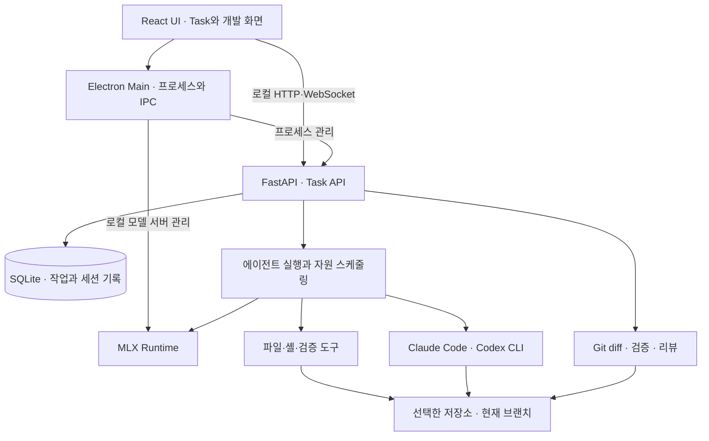

# Janus

> 코딩 에이전트의 작업부터 검증, 리뷰, 커밋까지 이어지는
> 로컬 우선 에이전트 개발 환경, Agent Development Environment.

[제품 설계](PRODUCT.md) · [검증 기록](V1_AUDIT.md) · [개발 기록](STATUS.md)

<!-- 대표 화면 캡처: Task 대화와 변경 diff, 검증 결과가 함께 보이는 실제 앱 화면 -->

## 1. 프로젝트 소개

Janus는 코딩 에이전트에게 작업을 맡기고, 변경 내용과 검증 결과를 확인한 뒤 커밋과 PR로 연결하는 데스크톱 개발 도구입니다. 대화, 터미널, 에디터, 미리보기와 리뷰를 하나의 Task에 모읍니다.

출발점은 **로컬 컴퓨터의 제한된 자원으로 검증된 작업 결과를 얼마나 얻을 수 있는가**였습니다. 모델이 답변을 마친 뒤에도 파일 변경 확인, 테스트, 리뷰와 전달이 남습니다. 이 과정을 한 흐름으로 연결하고, 모델 생성과 도구 실행의 병목을 구분할 수 있도록 설계했습니다.

| 항목 | 내용 |
| --- | --- |
| 개발 형태 | 1인 개발 |
| 대상 사용자 | 코딩 에이전트의 작업을 감독하고 결과를 직접 검토하는 개인 개발자 |
| 실행 환경 | Apple Silicon macOS |
| 모델 실행 | MLX 로컬 모델 또는 기존 Claude Code·Codex CLI |
| 핵심 설계 | Task 중심 작업 관리 · Git 기반 diff · 검증한 변경에 대한 리뷰와 커밋 |

<!-- 보완: 개발 기간과 이 도구를 직접 만들게 된 개인적인 경험, 개발 과정의 AI 활용 사례 -->

## 2. 주요 기능과 화면

### Task에 모이는 작업 맥락

프로젝트와 목표를 기준으로 에이전트를 실행하고, 대화와 변경 diff, 검증 결과를 같은 Task에서 확인합니다. 작업 중인 상태, 사용자 입력이 필요한 상태, 실패와 리뷰 대기를 구분합니다.

<!-- 화면 캡처: 프로젝트와 Task 목록, 작업 상세 -->

### 로컬 모델과 구독형 CLI

기본 실행 경로는 `mlx-community/Qwen3.8-27B-4bit`를 사용하는 MLX 로컬 모델입니다. 로컬 모델은 기기에서 추론하며, 사용자가 이미 로그인한 Claude Code나 Codex CLI도 실행기로 선택할 수 있습니다. 실행 경로에 따라 외부 서비스 이용 여부와 도구 승인 방식이 달라집니다.

<!-- 화면 캡처: 실행 모델 선택과 로컬 모델 상태 -->

### 변경 검토부터 커밋까지

Git에서 도출한 diff를 확인하고, 해당 변경에 대한 검증과 리뷰를 거쳐 커밋합니다. 선택적으로 인증된 `gh` CLI를 통해 push와 PR로 이어갈 수 있습니다.

<!-- 화면 캡처: diff, 검증 결과와 리뷰 -->

### 작업에 연결된 개발 도구

분할 터미널, Monaco 에디터, 로컬 미리보기와 브라우저의 콘솔·네트워크 정보를 Task에 연결합니다. 화면 캡처와 DOM·CSS 맥락도 작업을 설명하는 자료로 활용합니다.

<!-- 화면 캡처: 에디터, 터미널과 미리보기 -->

## 3. 시스템 아키텍처

Electron은 데스크톱 앱과 백엔드·모델 프로세스를 관리합니다. FastAPI 백엔드는 Task, 세션, 도구 실행과 리뷰 흐름을 연결하고, SQLite에는 제품의 작업 기록을 저장합니다. 코드 변경의 기준은 별도 스냅샷이 아닌 실제 저장소의 Git입니다.

| 영역 | 기술 |
| --- | --- |
| 데스크톱 | Electron · React · TypeScript · Zustand |
| 개발 화면 | Monaco Editor · 터미널 · 브라우저 미리보기 |
| 백엔드 | Python · FastAPI · HTTP·WebSocket · SQLite |
| 로컬 추론 | Apple Silicon · MLX · Qwen 27B 4-bit |
| 결과 관리 | Git · 선택적 GitHub CLI 연동 |
| 검증과 배포물 | pytest · TypeScript 검사 · 프론트엔드 테스트 · macOS 패키징 CI |

## 4. AI 작업을 관리하는 방식

### 작업 단위로 맥락과 권한을 제한합니다

오케스트레이터는 필요한 하위 작업을 worker에 맡기고, AgentProfile로 사용할 도구를 정합니다. worker 수와 시간·토큰·단계 예산을 제한해 위임이 자원 사용을 무제한으로 늘리지 않도록 구성했습니다.

### 생성과 검증의 대기를 나눕니다

로컬 모델의 생성 슬롯과 도구·검증 작업을 구분해 관리합니다. 모델 생성이 대기하는 동안 수행할 수 있는 도구 작업과 검증은 겹쳐 실행하고, 생성량뿐 아니라 검증 통과율, 소요 시간, 토큰과 사용자 개입을 함께 비교합니다.

### 검토한 변경과 커밋할 변경을 맞춥니다

에이전트 실행 종료, 검증 완료, 리뷰 수락, 커밋·push 성공을 서로 다른 상태로 다룹니다. 커밋 흐름에서는 현재 revision에 대한 리뷰와 검증 결과를 확인하며, push에는 Janus가 기록한 커밋과 HEAD의 일치 및 명시적인 SHA 확인을 요구합니다.

[제품 원칙](PRODUCT.md) · [검증 당시의 감사 기록](V1_AUDIT.md)

## 5. 개발 철학과 설계 결정

### 답변 완료와 작업 성공을 구분합니다

모델이 응답을 끝냈다는 사실만으로 파일 수정이나 테스트가 성공했다고 판단할 수는 없습니다. Janus는 실행 상태와 변경·검증·리뷰 상태를 구분해 사용자가 다음 판단에 필요한 근거를 볼 수 있도록 합니다.

### 코드 변경의 기준은 Git으로 유지합니다

에이전트는 사용자가 선택한 저장소의 현재 브랜치에서 직접 작업합니다. 실제 개발 상태와 가까워지는 대신, Task별 작업 사본이나 독립 worktree는 제공하지 않습니다. 같은 프로젝트의 Task는 작업 트리를 공유하며 동시 실행을 제한합니다.

이 선택은 커밋되지 않은 변경을 별도로 보존해주지 않는다는 한계가 있습니다. 작업 기록을 저장하는 SQLite와 코드 변경을 관리하는 Git의 역할도 구분합니다.

### 실행 경로별 통제 범위를 드러냅니다

로컬 모델과 Claude Code 경로는 Janus의 도구 승인 흐름을 사용합니다. Claude Code에는 Janus 도구를 MCP로 연결하며, Codex 경로는 같은 방식의 개별 작업 승인을 제공하지 않습니다.

파일 도구의 저장소 경로 제한은 OS 수준의 격리와 다릅니다. 특히 셸의 작업 디렉터리를 설정하는 것만으로 접근 경로 전체를 제한할 수는 없습니다. 제공하는 기능과 통제 범위를 함께 설명하는 것을 제품의 일부로 봅니다.

[실행 권한과 보안 경계](SECURITY.md)

## 6. 검증과 개선 기록

### 같은 조건에서 worker 효율 비교

2026년 8월 23일 v1 감사 기록에는 동일한 고정 worker 정책의 초기·개선 결과를 비교한 실험이 남아 있습니다.

| 지표 | 초기 기준 | 개선 결과 |
| --- | ---: | ---: |
| 수용 검증 통과 | 14/15 | 14/15 |
| 소요 시간 | 109.93초 | 88.14초 |
| 프롬프트 토큰 | 14,855 | 10,993.1 |
| 생성 토큰 | 1,227.9 | 777.4 |

해당 실험에서는 검증 통과 수를 유지하면서 시간과 토큰 사용량을 줄였습니다. 이는 당시의 모델·작업·정책에 대한 결과이며, 모든 프로젝트나 현재 버전의 성능을 보장하는 수치는 아닙니다.

같은 감사에는 실제 27B 모델로 수행한 TaskSuite 45회 중 44회 수용 검증 통과, 281회 복구 반복 후 일시 상태 잔여 수 0과 SQLite 무결성 확인도 기록돼 있습니다.

[실험 조건과 근거 — v1 감사](V1_AUDIT.md)

### 문서와 구현의 차이도 검사

과거 설계 문서가 현재 기능을 보장하는 것처럼 읽히지 않도록, 제공 모델과 작업 공간 경계 등 문서의 주요 설명을 코드와 대조하는 검사를 둡니다. 제거한 worktree 격리와 추가된 CLI 실행 경로도 문서에 반영합니다.

CI에서는 백엔드와 UI 검사, 번들 크기, 의존성 감사와 macOS 패키징을 검증합니다. 실제 로컬 모델 생성은 모델 파일과 기기 자원이 필요하므로, CI와 별도의 실기기 검증으로 구분합니다.

[문서·코드 일치 검사](janus_server/tests/test_docs_match_code.py) · [CI 구성](.github/workflows/ci.yml)

### 작업 기록의 복구 가능성

작업 데이터의 백업·복원, 중단된 실행의 상태 정리, 민감정보를 제거한 진단 묶음을 제공합니다. 앱이 다시 시작됐을 때 이전 작업을 성공한 것처럼 표시하지 않고, 실제로 중단된 상태를 복구하는 데 초점을 둡니다.

[데이터 복구 정책](janus_server/RECOVERY.md)

## 7. 한계와 개선 방향

Janus는 Apple Silicon macOS를 중심으로 개발 중인 개인 프로젝트입니다. 로컬 27B 모델은 상당한 디스크와 통합 메모리를 필요로 하며, CLI 실행 경로와 로컬 실행 경로의 승인 동작도 동일하지 않습니다.

같은 저장소 안에서 Task를 격리하지 않는 현재 구조, 로컬 자원에서의 worker 효율, 실행기별 통제 차이는 계속 다뤄야 할 과제입니다. 제품 설계와 과거 실험은 현재 구현과 구분해 기록합니다.

<!-- 보완: 실제 앱 화면, 개발 기간, Janus 자체 개발에서 AI를 활용한 구체적인 판단·검증 사례 -->

## 관련 문서

- [제품 설계](PRODUCT.md)
- [개발 기록](STATUS.md) · [향후 계획](ROADMAP.md)
- [디자인 시스템](DESIGN_SYSTEM.md)
- [기여 안내](CONTRIBUTING.md) · [버전 정책](VERSIONING.md)

## 라이선스

Janus는 [Apache-2.0](LICENSE)으로 공개합니다. 다운로드하는 모델에는 각 모델의 별도 이용 조건이 적용됩니다. 고급 모델 선택지의 연구용 사용 범위 등은 해당 모델 카드와 앱의 안내를 따릅니다.
